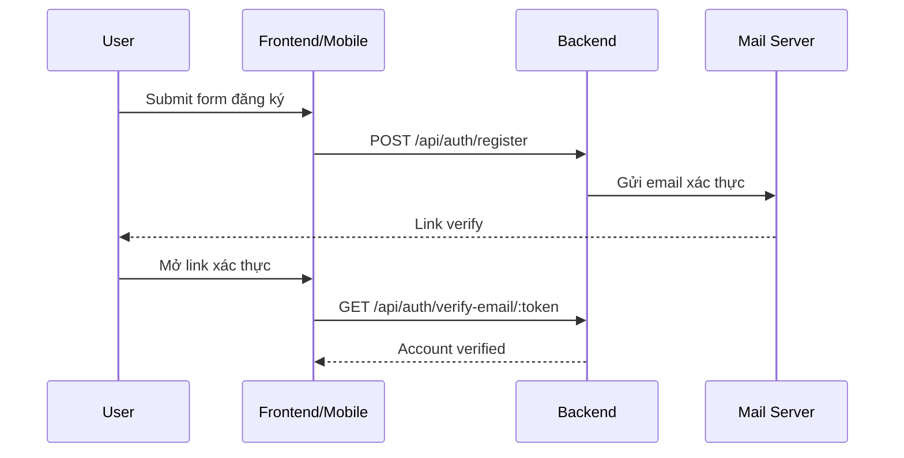
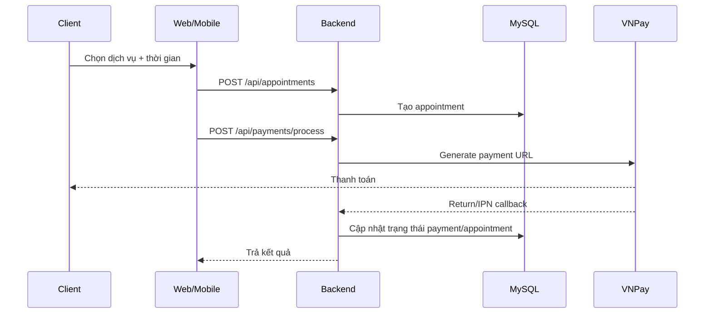
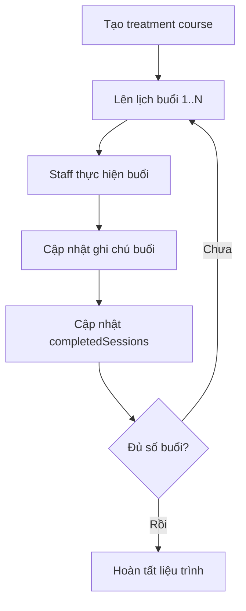

# Anh Thơ Spa Management System

Hệ thống quản lý Spa đa nền tảng gồm **Web (Admin/Staff/Client)** + **Mobile App** + **Backend API**, xây dựng để xử lý các bài toán thực tế:

- Đặt lịch dịch vụ, quản lý lịch hẹn, theo dõi trạng thái xử lý
- Quản lý liệu trình nhiều buổi (treatment course)
- Thanh toán VNPay + xử lý callback/IPN
- Khuyến mãi/voucher, ví điểm, thông báo
- Xác thực người dùng, phân quyền theo vai trò
- Chatbot AI hỗ trợ tư vấn

---

## Mục lục

- [1. Kiến trúc hệ thống](#1-kiến-trúc-hệ-thống)
- [2. Công nghệ sử dụng](#2-công-nghệ-sử-dụng)
- [3. Cấu trúc thư mục](#3-cấu-trúc-thư-mục)
- [4. Yêu cầu môi trường](#4-yêu-cầu-môi-trường)
- [5. Phiên bản package chính](#5-phiên-bản-package-chính)
- [6. Cấu hình biến môi trường](#6-cấu-hình-biến-môi-trường)
- [7. Hướng dẫn cài đặt từ đầu](#7-hướng-dẫn-cài-đặt-từ-đầu)
- [8. Cách chạy chương trình](#8-cách-chạy-chương-trình)
- [9. Luồng nghiệp vụ chính](#9-luồng-nghiệp-vụ-chính)
- [10. API chính](#10-api-chính)
- [11. Scripts quan trọng](#11-scripts-quan-trọng)
- [12. Troubleshooting](#12-troubleshooting)
- [13. Bảo mật dự án](#13-bảo-mật-dự-án)
- [14. Hướng dẫn phát triển](#14-hướng-dẫn-phát-triển)

---

## 1. Kiến trúc hệ thống

```text
┌──────────────────────────────┐
│ Web Frontend (React + Vite) │
└───────────────┬──────────────┘
                │
                │
┌───────────────▼──────────────┐
│ Backend API (Express + ORM)  │
└───────┬──────────┬───────────┘
        │          │
        │          │
        │          └──────────────► VNPay
        │
        ├─────────────────────────► SMTP Email Service
        ├─────────────────────────► Google Gemini API
        └─────────────────────────► MySQL Database

┌───────────────────────────────┐
│ Mobile App (React Native Expo)│
└───────────────┬───────────────┘
                │
                └────────────────► Backend API
```

- `backend/` là trung tâm xử lý nghiệp vụ và dữ liệu.
- `frontend/` phục vụ giao diện Web cho nhiều vai trò.
- `mobile/` phục vụ trải nghiệm đặt lịch trên thiết bị di động.

---

## 2. Công nghệ sử dụng

### Backend

- Node.js, Express.js
- Sequelize ORM, MySQL
- JWT, bcrypt/bcryptjs
- multer, nodemailer, node-cron
- VNPay SDK, Google GenAI SDK

### Frontend Web

- React + TypeScript + Vite
- React Router DOM
- TailwindCSS/PostCSS
- Recharts

### Mobile

- React Native + Expo
- React Navigation
- AsyncStorage, Axios
- Expo Notifications

---

## 3. Cấu trúc thư mục

```text
.
├── backend/
│   ├── config/                 # DB config, sequelize config, VNPay config
│   ├── controllers/            # Controllers theo domain
│   ├── migrations/             # Sequelize migrations
│   ├── models/                 # Sequelize models + associations
│   ├── routes/                 # API routes
│   ├── services/               # Business logic services
│   ├── scripts/                # Scripts kiểm tra/sửa DB
│   ├── public/                 # Public static files
│   ├── assets/
│   ├── package.json
│   └── server.js               # Entry backend
│
├── frontend/
│   ├── admin/                  # UI Admin
│   ├── client/                 # UI Client web
│   ├── staff/                  # UI Staff web
│   ├── components/             # Shared components
│   ├── shared/                 # Shared utils/icons
│   ├── services/
│   ├── public/
│   ├── App.tsx
│   ├── index.tsx
│   ├── vite.config.ts
│   └── package.json
│
├── mobile/
│   ├── src/
│   │   ├── screens/            # Màn hình app
│   │   ├── navigation/         # Điều hướng
│   │   ├── services/           # API client mobile
│   │   ├── components/
│   │   └── ...
│   ├── android/
│   ├── app.json
│   └── package.json
│
├── .githooks/                  # Local pre-commit hook
└── README.md
```

---

## 4. Yêu cầu môi trường

### Bắt buộc

- Node.js: **>= 20 LTS** (khuyến nghị)
- npm: đi kèm Node.js
- MySQL: **8.x**
- Git

### Khuyến nghị công cụ hỗ trợ

- MySQL Workbench hoặc DBeaver
- Postman
- VS Code
- Android Studio / Xcode (nếu chạy mobile native)

---

## 5. Phiên bản package chính

### backend/package.json

- express `^4.19.2`
- sequelize `^6.37.7`
- mysql2 `^3.15.3`
- jsonwebtoken `^9.0.2`
- dotenv `^16.4.5`
- @google/genai `^1.29.0`
- vnpay `^1.6.1`

### frontend/package.json

- react `^19.2.0`
- react-dom `^19.2.0`
- vite `^6.2.0`
- typescript `~5.8.2`
- tailwindcss `^3.4.19`

### mobile/package.json

- expo `~54.0.25`
- react `19.1.0`
- react-native `0.81.5`
- @react-navigation/native `^7.1.20`
- expo-notifications `^0.32.13`

---

## 6. Cấu hình biến môi trường

## 6.1 Backend: `backend/.env`

Tạo file `backend/.env` với nội dung mẫu:

```env
# Server
PORT=3001
NODE_ENV=development
FRONTEND_URL=http://localhost:3000

# Database
DB_HOST=127.0.0.1
DB_PORT=3306
DB_NAME=anhthospa_db
DB_USER=root
DB_PASSWORD=
DB_SSL=false
DB_ALTER_ON_START=false

# Auth
JWT_SECRET=your_strong_jwt_secret

# VNPay
VNPAY_TMN_CODE=your_tmn_code
VNPAY_HASH_SECRET=your_hash_secret
VNPAY_RETURN_URL=http://localhost:3001/api/payments/vnpay-return
VNPAY_IPN_URL=http://localhost:3001/api/payments/vnpay-ipn

# Gemini
GEMINI_API_KEY=your_gemini_api_key
GEMINI_MODEL=gemini-2.5-flash
GEMINI_API_VERSION=v1beta

# SMTP
SMTP_HOST=smtp.gmail.com
SMTP_PORT=587
SMTP_SECURE=false
SMTP_USER=your_email
SMTP_PASS=your_app_password
```

## 6.2 Frontend: `frontend/.env`

```env
VITE_API_URL=http://localhost:3001/api
GEMINI_API_KEY=your_gemini_api_key
```

> `vite.config.ts` hiện map `GEMINI_API_KEY` vào các biến runtime phục vụ client.

## 6.3 Mobile

`mobile/src/services/apiService.ts` đang hard-code base URL theo platform.

- Android emulator: `http://10.0.2.2:3002/api` (đang để trong code)
- iOS/device: cập nhật LAN IP máy chạy backend

Nếu backend chạy cổng `3001`, cần sửa đồng bộ URL mobile về đúng cổng.

---

## 7. Hướng dẫn cài đặt từ đầu

### Bước 1: Clone source

```bash
git clone <repository-url>
cd SourceCode_B49_LeThiThuyLan
```

### Bước 2: Cài dependencies cho từng module

```bash
cd backend && npm install
cd ../frontend && npm install
cd ../mobile && npm install
```

### Bước 3: Tạo database MySQL

Ví dụ dùng MySQL command line:

```sql
CREATE DATABASE anhthospa_db CHARACTER SET utf8mb4 COLLATE utf8mb4_unicode_ci;
```

### Bước 4: Cấu hình `backend/.env` và `frontend/.env`

Tham khảo mục [6. Cấu hình biến môi trường](#6-cấu-hình-biến-môi-trường).

### Bước 5: Chạy migration

```bash
cd backend
npm run db:migrate
```

### Bước 6: Khởi động hệ thống

Chạy theo mục [8. Cách chạy chương trình](#8-cách-chạy-chương-trình).

---

## 8. Cách chạy chương trình

Mở 3 terminal riêng:

### Terminal A - Backend

```bash
cd backend
npm run dev
```

Backend API: `http://localhost:3001/api`

### Terminal B - Frontend Web

```bash
cd frontend
npm run dev
```

Web app: `http://localhost:3000`

### Terminal C - Mobile

```bash
cd mobile
npm start
```

- Android emulator: bấm `a`
- iOS simulator: bấm `i` (macOS)
- Web preview: `npm run web`

---

## 9. Luồng nghiệp vụ chính

### 9.1 Đăng ký và xác thực email



### 9.2 Đặt lịch + thanh toán VNPay



### 9.3 Liệu trình điều trị nhiều buổi



---

## 10. API chính

> Base URL: `http://localhost:3001/api`

### Authentication

- `POST /auth/register`
- `POST /auth/login`
- `GET /auth/verify-email/:token`
- `POST /auth/forgot-password`

### Services / Appointments

- `GET /services`
- `GET /services/:id`
- `POST /appointments`
- `GET /appointments/user/:userId`

### Payments / Promotions

- `POST /payments/process`
- `GET /payments/user/:userId`
- `GET /promotions`
- `POST /promotions/:id/redeem`

### Treatment

- `GET /treatment-courses`
- `GET /treatment-sessions`

### Notifications / Chatbot

- `GET /notifications/user/:userId`
- `POST /chatbot/chat`

---

## 11. Scripts quan trọng

### Backend

- `npm run dev` — chạy backend với nodemon
- `npm run start` — chạy production
- `npm run db:migrate` — apply migrations
- `npm run db:migrate:undo` — rollback 1 migration
- `npm run db:migrate:undo:all` — rollback toàn bộ
- `npm run db:migrate:status` — kiểm tra trạng thái migration

### Frontend

- `npm run dev` — chạy Vite dev server
- `npm run build` — build production
- `npm run preview` — preview build

### Mobile

- `npm start` — expo start offline
- `npm run start:online` — expo start online
- `npm run start:clear` — clear cache và start
- `npm run android` — chạy Android native
- `npm run ios` — chạy iOS native

---

## 12. Troubleshooting

### Lỗi không kết nối DB

- Kiểm tra MySQL service đang chạy
- Kiểm tra `DB_HOST`, `DB_PORT`, `DB_USER`, `DB_PASSWORD`, `DB_NAME`
- Chạy lại `npm run db:migrate`

### Frontend không gọi được API

- Kiểm tra `frontend/.env` (`VITE_API_URL`)
- Kiểm tra backend có chạy ở `3001`
- Kiểm tra CORS backend

### Mobile không gọi được API

- Android emulator dùng `10.0.2.2`
- Thiết bị thật cần LAN IP của máy host
- Đồng bộ đúng cổng backend đang chạy

### Lỗi VNPay callback

- Kiểm tra `VNPAY_RETURN_URL`, `VNPAY_IPN_URL`
- Kiểm tra `FRONTEND_URL`

---

## 13. Bảo mật dự án

- Không commit `.env`, key, token, private key.
- Dự án đã có:
  - Local hook: `.githooks/pre-commit`
- Nếu phát hiện lộ key:
  1. Rotate key ngay tại nhà cung cấp
  2. Purge lịch sử Git nếu key đã vào commit
  3. Cập nhật lại env local + secrets trên các môi trường liên quan

---
